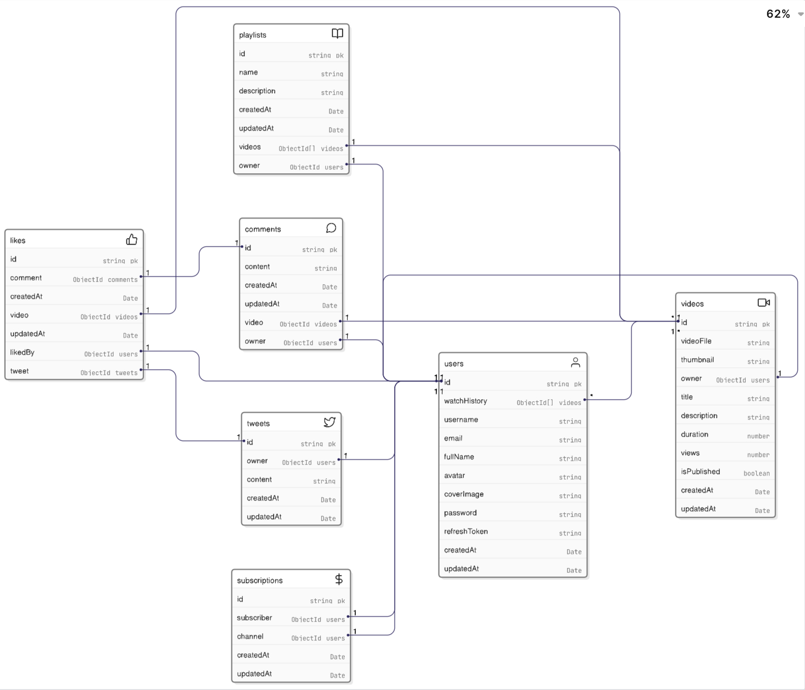

# A backend project

# Data-Modelling


# how to use 3 utils we have build (ApiError, ApiResponse, asyncHandler)
```javascript
import express from "express";
import { asyncHandler } from "../utils/asyncHandler.js";
import { ApiResponse } from "../utils/ApiResponse.js";
import { ApiError } from "../utils/ApiError.js";

const router = express.Router();

// Example fake DB call
const fakeUserDB = [{ id: "1", name: "Alice" }];

router.get(
  "/:id",
  asyncHandler(async (req, res, next) => {
    const user = fakeUserDB.find((u) => u.id === req.params.id);

    if (!user) {
      throw new ApiError(404, "User not found");
    }

    const response = new ApiResponse(200, user, "User fetched successfully");
    res.status(200).json(response);
  })
);

export default router;

```
And following will be the output in case of success
✔️   /users/1
```javascript
{
  "statusCode": 200,
  "data": { "id": "1", "name": "Alice" },
  "message": "User fetched successfully",
  "success": true
}

```
And following will be the output in case of failure
❌  /users/99
```javascript
{
  "success": false,
  "message": "User not found",
  "errors": [],
  "data": null
}

```