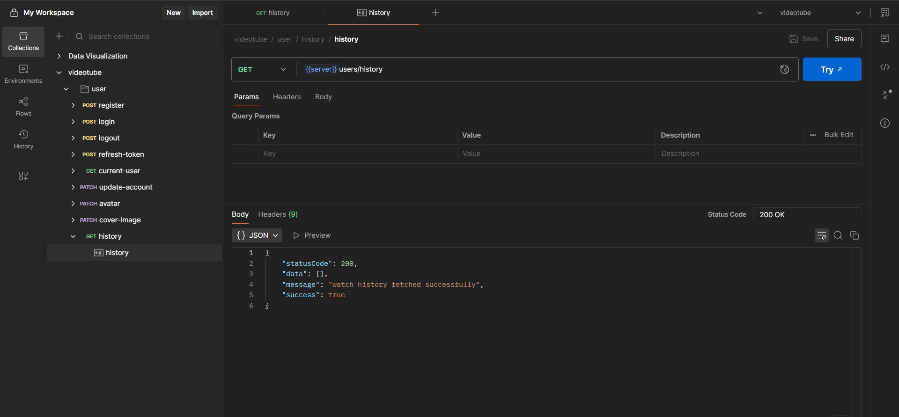

# A backend project

### Data-Modelling


### How to use 3 utils I have build (ApiError, ApiResponse, asyncHandler)
```javascript
import express from "express";
import { asyncHandler } from "../utils/asyncHandler.js";
import { ApiResponse } from "../utils/ApiResponse.js";
import { ApiError } from "../utils/ApiError.js";

const app = express();

// Example fake DB call
const fakeUserDB = [{ id: "1", name: "Alice" }];

app.get(
  "/:id",
  asyncHandler(async (req, res, next) => {
    const user = fakeUserDB.find((u) => u.id === req.params.id);

    if (!user) {
      throw new ApiError(404, "User not found");
    }

    const response = new ApiResponse(200, user, "User fetched successfully");
    res.status(200).json(response);
  })
);

export default router;

```
And following will be the output in case of success
✔️   /users/1
```javascript
{
  "statusCode": 200,
  "data": { "id": "1", "name": "Alice" },
  "message": "User fetched successfully",
  "success": true
}

```
And following will be the output in case of failure
❌  /users/99
```javascript
{
  "success": false,
  "message": "User not found",
  "errors": [],
  "data": null
}

```

### Uploding file from device to server using multer

```javascript 
import multer from "multer";

const storage = multer.diskStorage({
  destination: function (req, file, cb) {
    cb(null, "./public/temp");
  },
  filename: function (req, file, cb) {
    cb(null, file.originalname + "-" + Date.now());
  },
});

export const upload = multer({
  storage: storage,
  // storage: storage binds the custom multer.diskStorage() logic to your multer upload handler.
});
```

### Uploding file from server to cloud using cloudinary 

```javascript
import { v2 as cloudinary } from "cloudinary";
import fs from "fs";

cloudinary.config({
  cloud_name: process.env.CLOUDINARY_CLOUD_NAME,
  api_key: process.env.CLOUDINARY_API_KEY,
  api_secret: process.env.CLOUDINARY_API_SECRET,
});

const uploadOnCloudinary = async (localFilePath) => {
  try {
    if (!localFilePath) return null;

    // upload the file on cloudinary
    const response = await cloudinary.uploader.upload(localFilePath, {
      resource_type: "auto",
    });
    //file has been uploaded succesful
    console.log("file is uploaded on cloudinary", response.url);
    return response;

  } catch (error) {
    //remove the locally saved temporary file as the upload operation got failed
    fs.unlinkSync(localFilePath)
  }
};

export { uploadOnCloudinary }
```

### Creating usercontroller

* get user details from frontend
* validation - if not empty
* check if user altready exists: username, email
* check for images , check for avatar (multer)
* upload them to cloudinary check fir avatar in (cloudinary)
* create user object - create entry in db
* remove password and refresh token field from respone
* check for user creation 
* return response

# Testing through Postman

### Checking registration route/multer/mongodb/cloudinary working


### Checking login functionality and accessToken And refreshToken generation


### Checking logout functionality
logout done and cookies are also deleted


### Checking refresh token functionality


### Checking change-password functionality


### Checking currentuser route


### Checking update account details functionality


### Checking update avatar image functionality


### Checking update cover image functionality


### Checking watchHistory functionality

